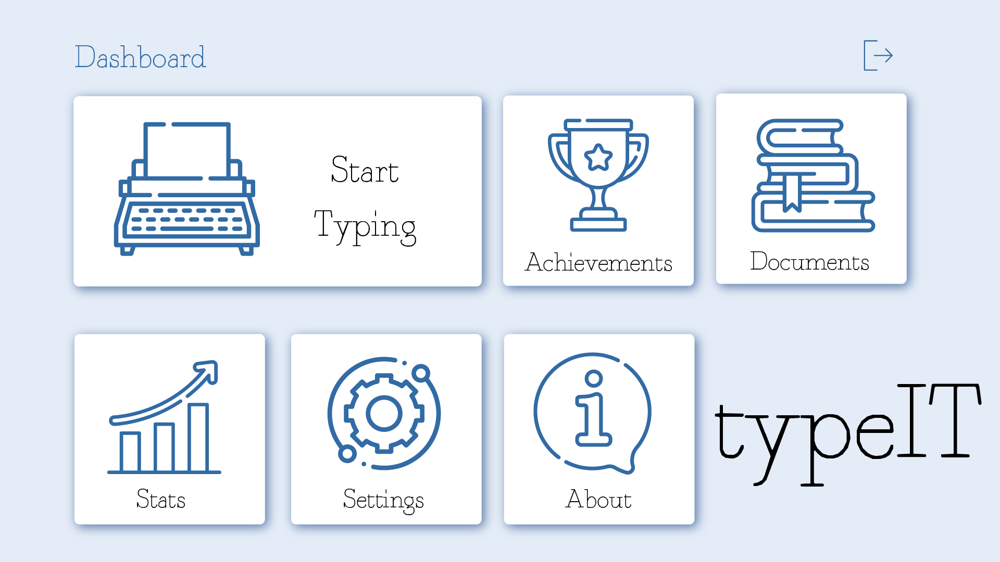
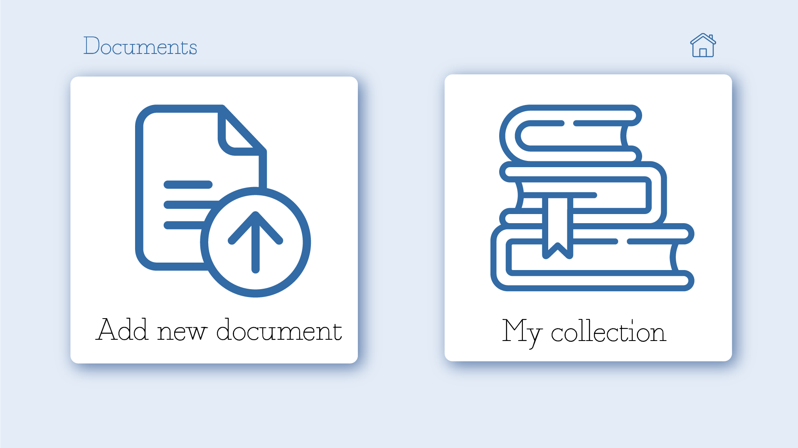
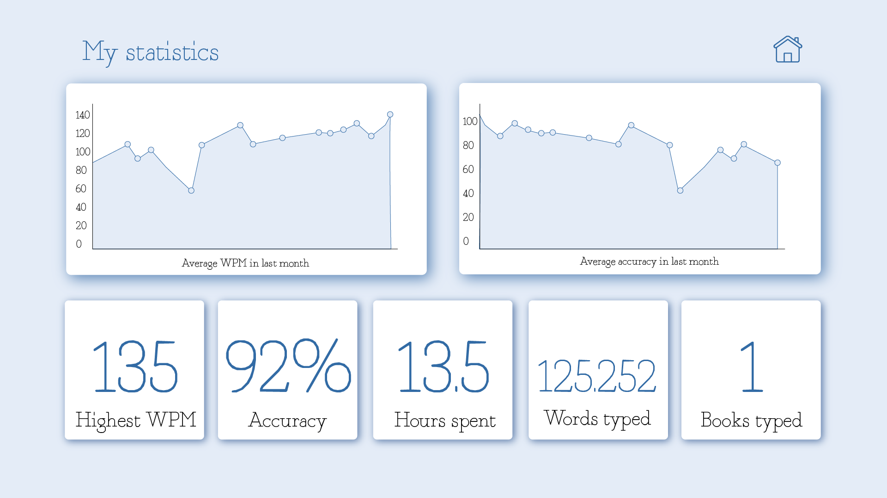
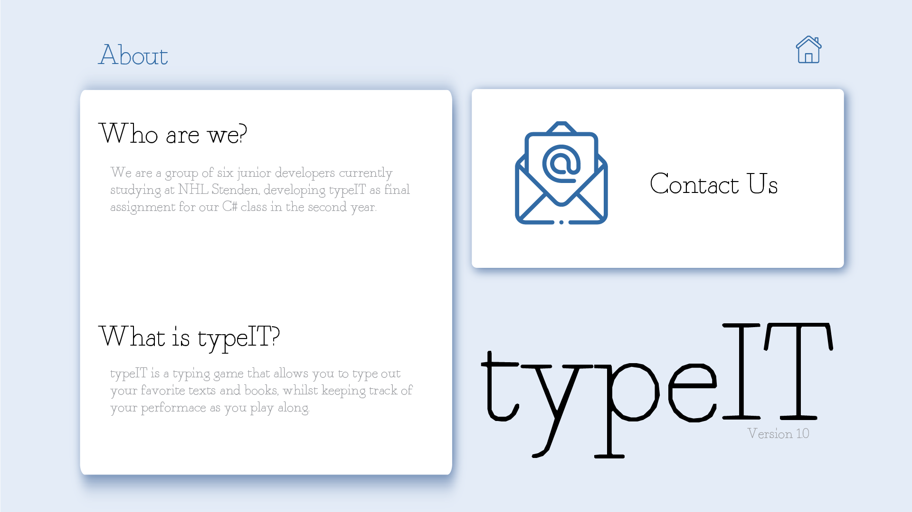
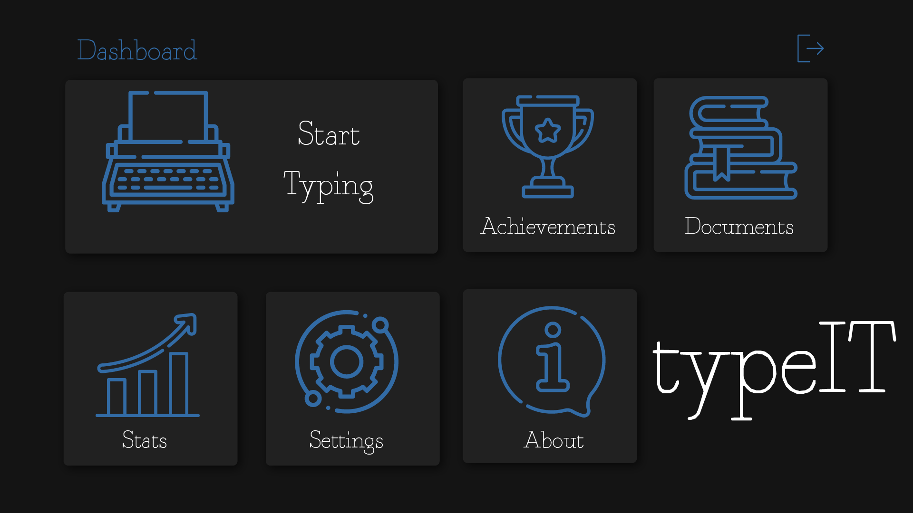
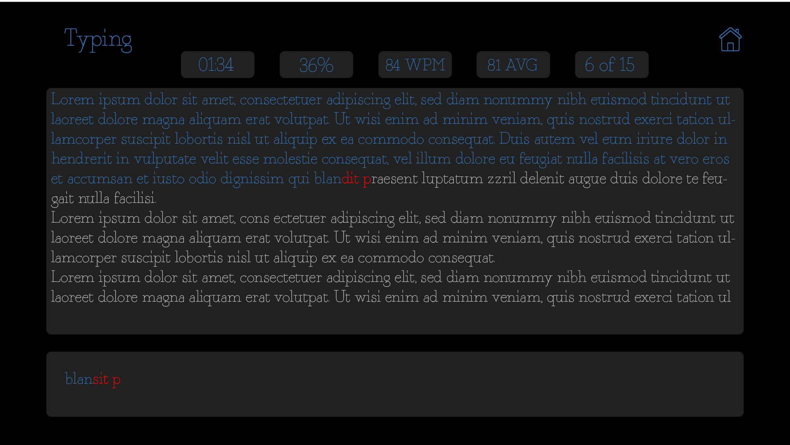
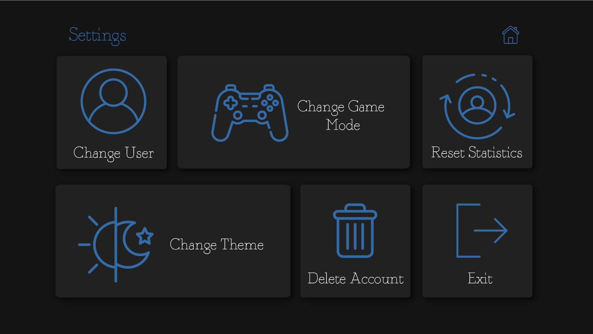

# TypeIT

## Version History

| Version       | Changes                                     | Date     |
|---------------|---------------------------------------------|----------|
|0.1.0          |Creation of document                         |23/04/2021|
|0.1.1          |Added the idea                               |23/04/2021|
|0.2.0          |Added the team roles                         |26/04/2021|
|0.2.1          |Added the planning                           |26/04/2021|
|0.2.2          |Added the gantt chart                        |26/04/2021|
|0.2.3          |Added the Moscow stuff                       |26/04/2021|
|0.3.0          |Added the literature                         |29/04/2021|
|0.3.1          |Added the mockups                            |29/04/2021|
|0.3.2          |Added the use case diagram                   |29/04/2021|
|0.4.0          |Added the light theme mockups                |30/04/2021|
|0.4.1          |Added the dark theme mockups                 |30/04/2021|
|0.4.2          |Updated gantt chart, fixed version numbering |30/04/2021|
|1.0.0          |Finalized document for submission            |30/04/2021|

## Group Roles
- **Abdalrahman Ghname**: Front-end
- **Chris Takacs**: Front-end
- **Costandino Hiripis**: Front-end
- **Georgi Dimitrov**: Back-end
- **Steffen Tourbier**: Leader, Back-end
- **Pepe Loperena**: Back-end

## Idea
A group of students wants a better way of practicing their typing. These students wanted to be able to read books they enjoy
while at the same time type them out to practice typing better. To achieve this, the application needs to be able to provide
specific functionalities to the user. The user should be able to input their own choice of text through a file, either pdf, text,
or other file types; depending on what file the user in puts, they should also be able to select a specific page for typing practice.
Additionally, the user must be able to see their statistics and progression through typing practice using the application - statistics
for the current text being typed should also be displayed.

Different users should be able to use the application on the same computer, at different times. In addition, different users 
should have different profiles where their personal stats are recorded. Users should also be able to select different difficulties for
each text they want to practice typing. To achieve this, the following game modes will be available - Casual: no trackers, type at your
own pace; Normal: stat trackers, type at your own pace; Hard: stat trackers with a timer for each section to be typed; Instant Death: 
all the previous modifiers, but a single mistake means you have to restart the entire section of text.

## Use Case Diagram

## Mockups
The following are mockups for the application's main screens

### Light Mode
**Login Screen with 5 users**

**Login Screen with 6 users**

**Dashboard**

**Typing**

**Achievements**

**Documents**

**My Collection**

**Statistics**

**Settings**

**Change User with 5 users**

**Change User with 6 users**

**Change Game Mode**

**About**

### Dark Mode
**Login Screen with 5 users**

**Login Screen with 6 users**

**Dashboard**

**Typing**

**Achievements**

**Documents**

**My Collection**

**Statistics**

**Settings**

**Change User with 5 users**

**Change User with 6 users**

**Change Game Mode**

**About**

## Planning

### 1st week
    Creation of start document and edition of start document, Seperating group roles and tasks, 
    Pitch idea to lecturers, Mock ups.

### 2nd week
	Technical specification of project,start realization of project, 
    Send start document to lecturers

### 3rd week 
	Designing class diagram. 
	Front-end: Dashboard, Typing page, Start-up screen (UI)
	Back-end: Creating file structure for storing users

### 4th week 
	Class diagram to be sent to the lecturers
	Front-end: Library page, uplaod page, Open file, Document page(could be changed)
	Back-end: Accepting user input(key strokes), parsing file

### 5th week
	Front end: Settings, Live Statistics
	Back-end: Creating users / Storing users, Calculating statistics

### 6th week 
	Front end: Achievements, stats, FAQ
	Back end: Unlocking achievements
	Realization phase

### 7th week 
	Finalization phase 

### 8th week 
	Testing phase, prepare presentation

### 9th week
	Presentation

### Gantt Chart
The gantt chart for this project can be found [here](documents/gantt.pdf)

## Application features
For this project, the Moscow method was used to separate the different functionalities and see 
what had more priority than others. As the moscow method, we have separated the different functionalities within the different 
priorities. After research and thinking about the different functionalities this is what we have thought about: 

### Must have:
- Receiving user input and parsing it to the application.
- User input in the text file.
- Typing screen.

### Should have: 
- Statistics page for each user.
- Achievements page for each user.

### Could have: 
- Making our own file type to store user data.
- Information page for users to know about the application

### Will not have: 
- Multiplayer (Locally or online).
- Log in system (As it will be a local application).

## Literature

p.s.w.g (2013). Is there a proper way to create a file format. Stack Exchange. 
    Retrieved from: https://softwareengineering.stackexchange.com/questions/188536/is-there-a-proper-way-to-create-a-file-format

T. Levesque (2017). Easy text parsing in C# with Sprache. THOMAS LEVESQUE'S .NET BLOG. 
    Retrieved from: https://thomaslevesque.com/2017/02/23/easy-text-parsing-in-c-with-sprache/
